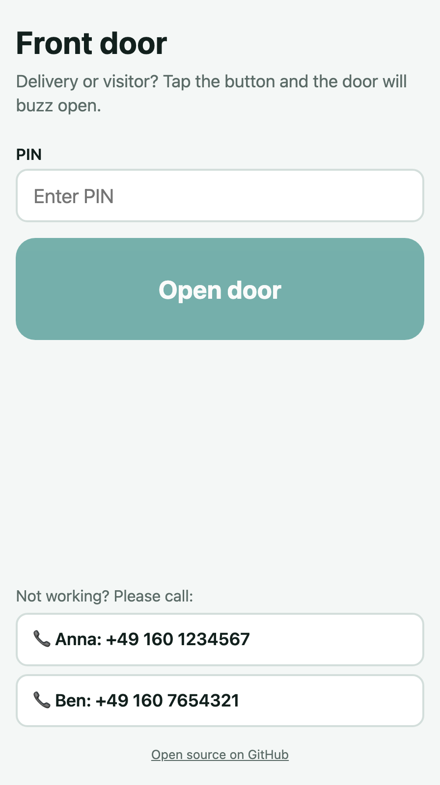
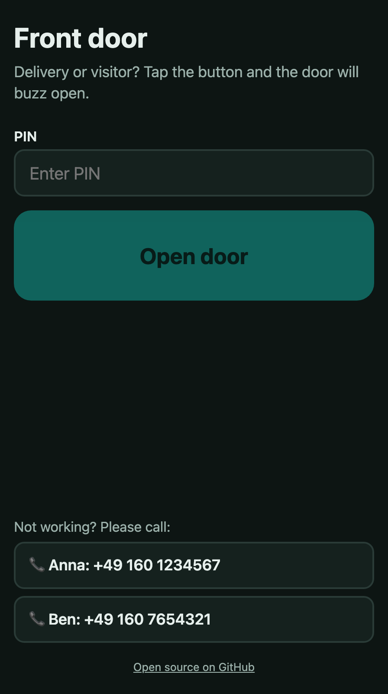

# Nuki Opener Link

[](https://github.com/Gimtiese/nuki-opener-link/actions/workflows/ci.yml)
[](LICENSE)

*English documentation: [README.md](README.md)*

Eine Webseite mit einem Button, über die Lieferanten und Besuch deine Tür per
**[Nuki Opener](https://nuki.io/de/opener/)** öffnen. Kostenlos bei Cloudflare gehostet, mit einem Befehl eingerichtet.

- **Ein Tipp für Besucher**: PIN, großer Button, fertig. Ohne App, ohne Konto.
- **Abgesichert**: weltweit wirksamer Schutz gegen PIN-Raten, Öffnungszeiten, optional Cloudflare Turnstile, strenge Sicherheits-Header.
- **Einfach**: `npm run setup` stellt ein paar Fragen und erledigt den Rest.
- **Kostenlos**: Cloudflare-Workers-Free-Plan, Nuki Web API, Turnstile.

```
Handy ──▶ Cloudflare Worker ──▶ Nuki Web API ──▶ Bridge ──▶ Opener ──▶ Summer
          prüft: Rate-Limit · Öffnungszeiten · Turnstile · PIN + Schutz gegen Raten
```

<p align="center">
  
  &nbsp;&nbsp;
  
</p>

> **Kein Nuki-Produkt.** „Nuki“ ist eine Marke der Nuki Home Solutions GmbH.
> Das Projekt öffnet eine Tür. Lies den Abschnitt [Sicherheit](#sicherheit), Nutzung auf eigene Gefahr.

## Voraussetzungen

- Ein **Nuki Opener** an deiner Sprechanlage, in der Nuki-App eingerichtet, **mit Nuki Bridge**.
- Ein [Nuki-Web](https://web.nuki.io)-Login (der Account, bei dem der Opener registriert ist).
- Ein kostenloses [Cloudflare-Konto](https://dash.cloudflare.com/sign-up). Eine eigene Domain ist optional.
- [Node.js](https://nodejs.org) 20 oder neuer und Git.

## Schnellstart

```bash
git clone https://github.com/Gimtiese/nuki-opener-link.git
cd nuki-opener-link
npm install
npm run setup
```

Der Installer braucht etwa fünf Minuten:

| Schritt | Was passiert |
| --- | --- |
| 1. Cloudflare | Öffnet den Browser zur Anmeldung (nur beim ersten Mal). |
| 2. Nuki | Fragt deinen [Nuki-API-Token](#nuki-api-token) ab (verdeckt), prüft ihn und findet deinen Opener. |
| 3. PIN | Erzeugt einen zufälligen 8-stelligen PIN für Besucher oder lässt dich einen wählen (mindestens 5 Zeichen). |
| 4. Öffnungszeiten | Rund um die Uhr, tagsüber (06:00–22:00) oder eigene Zeiten. |
| 5. Seite | Sprache, Überschrift und Telefonnummern für den Notfall. |
| 6. Adresse | Eigene Domain oder kostenlose `*.workers.dev`-Adresse, Turnstile an oder aus. |
| 7. Veröffentlichen | Legt das Turnstile-Widget an, baut, deployt, lädt die Secrets hoch und prüft, ob die Seite läuft. |

Am Ende bekommst du die Adresse, einen Link mit vorausgefülltem PIN und den PIN selbst. Notier ihn dir.

Erst mal nur die Fragen ansehen, ohne etwas zu ändern: `npm run setup -- --dry-run`.

### Nuki-API-Token

1. Auf [web.nuki.io](https://web.nuki.io) mit dem Account anmelden, bei dem dein Opener registriert ist.
2. **API** öffnen und einen Token erzeugen. Er braucht die Rechte **Smartlocks lesen** und **Smartlock-Aktionen ausführen**.
3. Sofort kopieren, er wird nur einmal angezeigt. Im Installer einfügen, wenn er danach fragt.

Den Token nie in eine Befehlszeile, einen Chat oder eine Datei im Repository schreiben.

## Im Alltag

| Aufgabe | So geht's |
| --- | --- |
| Jemandem Zugang geben | Adresse und PIN schicken, oder den Link `https://deine-adresse/#pin=12345678`. Der PIN im Link erreicht nie einen Server und verschwindet aus der Adresszeile. Die Seite merkt ihn sich auf dem Handy. |
| PIN ändern (Zugang entziehen) | `npx wrangler secret put ACCESS_PIN`. Wirkt sofort, alte PINs funktionieren nicht mehr. |
| Zeiten, Telefonnummern, Domain, Turnstile ändern | `npm run setup` erneut ausführen. Aktuelle Einstellungen sind vorausgefüllt; Nuki-Zugang und PIN bleiben, wenn du nichts anderes wählst. |
| Zusehen, was passiert | `npx wrangler tail` zeigt Live-Logs, auch falsche PINs und Sperren. |
| Auf neue Version aktualisieren | `git pull && npm install && npm run setup` |

## Sicherheit

Keine Seite, die eine Tür mit einem gemeinsamen PIN öffnet, ist 100 % sicher: Wer den PIN kennt, kommt rein.
Das Ziel ist, dass **Raten praktisch unmöglich** ist, Missbrauch begrenzt bleibt und nichts nach außen dringt.

### Schutzschichten

| Schicht | Schützt vor | Details |
| --- | --- | --- |
| Öffnungszeiten | Nutzung nachts | Außerhalb der Zeiten lässt sich die Tür gar nicht öffnen, auch nicht mit richtigem PIN. |
| Schutz gegen Raten | PIN-Raten, auch von vielen IPs | Ein globales [Durable Object](worker/guard.ts) sieht jeden Versuch weltweit. **Pro Absender** (IPv4-Adresse, IPv6-/64-Netz): nach 5 falschen PINs gesperrt, 1 Minute, verdoppelt bis 1 Stunde. **Global**: 30 falsche PINs innerhalb einer Stunde sperren die Tür für alle für 1 Stunde. Während einer Sperre wird auch der richtige PIN abgelehnt; eine Sperre verrät also nie, ob ein Versuch gestimmt hätte. |
| Turnstile (optional) | Bots und Skripte | Cloudflare prüft unsichtbar, ob ein Mensch die Seite nutzt, meist ohne Klick. Fehlgeschlagene Prüfungen zählen nie als PIN-Versuch. |
| Rate-Limit | Anfragefluten | 10 Anfragen pro Minute und Absender, bevor irgendetwas anderes läuft. |
| Secrets | Abfließende Zugangsdaten | Nuki-Token, PIN und Turnstile-Secret existieren nur als Worker-Secrets, nie in der Seite oder im Repository. Gerät und Aktion sind fest; die API kann nichts anderes. |
| Anfrageprüfung | Fremde Seiten, Müll | Nur `POST` mit JSON, fremde Origins werden abgewiesen, Body höchstens 4 KB, PIN-Vergleich in konstanter Zeit. |
| Header | Einschleusen, Einbetten, Downgrade | Strenge Content-Security-Policy, HSTS, kein Einbetten, kein Referrer, `noindex`. |

Mit diesen Grenzen dauert das Raten eines 5-stelligen PINs im Schnitt etwa zwei Monate Dauerangriff,
während die Tür etwa die Hälfte der Zeit gesperrt ist. Bei 8 Ziffern sind es Jahrhunderte. **Nimm 8 Ziffern.**

### Was du wissen solltest

- **Eine globale Sperre lässt sich absichtlich auslösen.** Wer dauerhaft rät, sperrt die Seite auch für echte Besucher. Sperren enden von selbst (höchstens 1 Stunde). Für diesen Fall zeigt die Seite deine Telefonnummern.
- **Der PIN verbreitet sich.** Lieferanten geben ihn weiter. Ändere ihn ab und zu und bei Verdacht auf Missbrauch.
- **Der gemerkte PIN** liegt im `localStorage` des Besucher-Handys.
- **Nuki bestätigt die Ausführung nicht.** Ist die Bridge offline, kann die Seite Erfolg melden, obwohl nichts passiert ist.
- **Turnstile braucht Cloudflare.** Blockiert ein Handy das Skript, kann dieser Besucher nicht öffnen und sieht die Telefonnummern.

### Konten absichern

Das größte reale Risiko ist nicht dieser Code, sondern deine Konten:

- Zwei-Faktor-Anmeldung für **Cloudflare** und **Nuki** einschalten.
- Der Worker braucht nur das Recht **Aktionen ausführen**. Wer mag, legt nach dem Setup einen zweiten Nuki-Token nur mit diesem Recht an und setzt ihn mit `npx wrangler secret put NUKI_API_TOKEN`.

Sicherheitslücke gefunden? Siehe [SECURITY.md](SECURITY.md).

## Konfigurationsübersicht

Der Installer verwaltet das alles. Für Änderungen von Hand:

| Einstellung | Wo | Hinweis |
| --- | --- | --- |
| `NUKI_API_TOKEN` | Worker-Secret | Nuki-Web-API-Token |
| `NUKI_SMARTLOCK_ID` | Worker-Secret | Geräte-ID aus `npm run smartlocks` |
| `ACCESS_PIN` | Worker-Secret | Mindestens 5 Zeichen, 8 Ziffern empfohlen |
| `TURNSTILE_SECRET_KEY` | Worker-Secret (optional) | Schaltet Turnstile ein; braucht `VITE_TURNSTILE_SITE_KEY` |
| `OPEN_HOURS` | `vars` in `wrangler.jsonc` (optional) | `07:00-21:00`; mehrere Zeiträume mit Komma, über Mitternacht wie `22:00-06:00`. Leer = immer |
| `TIMEZONE` | `vars` in `wrangler.jsonc` | IANA-Name wie `Europe/Berlin`; Pflicht mit `OPEN_HOURS` |
| `NUKI_ACTION` | `vars` in `wrangler.jsonc` (optional) | Standard `3` = Opener-Summer. Beim Smart Lock: 1 entriegeln, 2 verriegeln, 3 Falle öffnen |
| `routes` | `wrangler.jsonc` | Eigene Domain; schaltet die `workers.dev`-Adresse ab |
| `VITE_TURNSTILE_SITE_KEY` | `.env` (Build) | Turnstile-Site-Key |
| `VITE_SITE_TITLE` | `.env` (Build) | Überschrift und Browser-Titel |
| `VITE_CONTACTS` | `.env` (Build) | `[{"label":"Anna","phone":"+49 160 1234567"}]` |
| `VITE_LOCALE` | `.env` (Build) | `auto` (Standard), `en` oder `de` |

Werte aus `.env` landen in der öffentlichen Seite, **keine Secrets** eintragen. Nach Änderungen an `.env`
oder `wrangler.jsonc` `npm run deploy` ausführen. Ungültige Einstellungen beantwortet die API mit
`503 not_configured`, und `npx wrangler tail` nennt das Problem. Mit kaputter Konfiguration öffnet die Tür nie.

<details>
<summary><strong>Manuelle Einrichtung ohne Installer</strong></summary>

1. [Nuki-API-Token](#nuki-api-token) erzeugen und `npm run smartlocks` ausführen. Die erste Spalte der Zeile `Opener` ist deine Geräte-ID.
2. Optional: `cp .env.example .env` und bearbeiten.
3. Optional: Den Block `managed by npm run setup` in [`wrangler.jsonc`](wrangler.jsonc) für Domain und Öffnungszeiten bearbeiten.
4. Deployen und Secrets setzen (jeder Befehl fragt den Wert ab):

   ```bash
   npx wrangler login
   npm run deploy
   npx wrangler secret put NUKI_API_TOKEN
   npx wrangler secret put NUKI_SMARTLOCK_ID
   npx wrangler secret put ACCESS_PIN
   ```

5. Optional Turnstile: im [Cloudflare-Dashboard](https://dash.cloudflare.com/?to=/:account/turnstile) ein Widget für deinen Hostnamen anlegen, den Site-Key als `VITE_TURNSTILE_SITE_KEY` in `.env` eintragen, den Secret-Key mit `npx wrangler secret put TURNSTILE_SECRET_KEY` setzen, dann `npm run deploy`.

</details>

## Fehlersuche

Live-Logs: `npx wrangler tail`, dann den Button tippen.

| Seite oder Log sagt | Ursache und Lösung |
| --- | --- |
| „Der PIN ist nicht korrekt“ | Falscher PIN. Fünf falsche PINs sperren dieses Handy für eine Weile. |
| „Zu viele Fehlversuche …“ | Gesperrt durch den Schutz gegen Raten. Angezeigte Zeit abwarten (höchstens 1 Stunde). |
| „Nur zu diesen Zeiten …“ | Außerhalb der Öffnungszeiten. Mit `npm run setup` ändern. |
| „Die Sicherheitsprüfung ist fehlgeschlagen“ | Turnstile konnte keinen Menschen bestätigen. Seite neu laden; bleibt es so, `npm run setup` ausführen (prüft die Domain des Widgets). |
| „Konnte gerade nicht geöffnet werden“ + `Nuki API rejected the request: HTTP 401/403` | Token ungültig oder ohne Aktions-Recht. |
| … + `HTTP 400` oder `404` | Falsche Geräte-ID. Die Zahl aus `npm run smartlocks` verwenden und einen Token des Accounts, zu dem der Opener gehört. |
| … + `HTTP 5xx` oder Timeouts | Störung der Nuki-Cloud; der Worker hat schon 3-mal wiederholt. |
| Erfolg, aber der Summer bleibt still | Bridge oder Opener offline. Gerät in der Nuki-App prüfen. |
| `503 not_configured` | Eine Einstellung fehlt oder ist ungültig; das Log nennt sie. `npm run setup` ausführen. |
| Deploy scheitert mit Domain | Die Domain muss bei Cloudflare im selben Konto liegen. |

## Lokale Entwicklung

```bash
cp .dev.vars.example .dev.vars   # Testwerte, git-ignoriert
npm run preview                  # baut und startet den Worker auf http://localhost:8787
```

Mit dem Fake-Token aus dem Beispiel läuft der ganze Ablauf bis `502 nuki_unreachable`, ohne etwas zu öffnen.
`.dev.vars.example` enthält Cloudflares offiziellen Turnstile-**Test**-Secret; mit
`VITE_TURNSTILE_SITE_KEY=1x00000000000000000000AA npm run preview` lässt sich Turnstile lokal ausprobieren.
Für Frontend-Arbeit `npm run dev:worker` und `npm run dev` nebeneinander starten.
`npm run check` führt Typprüfung, alle Tests und den Build aus.

## Projektaufbau

```
worker/index.ts     API: Prüfungen der Reihe nach, Nuki-Aufruf
worker/guard.ts     Schutz gegen Raten (Durable Object)
shared/hours.js     Öffnungszeiten, von Worker und Installer genutzt
src/                Vue-3-Seite (App.vue, Turnstile, Texte en/de)
scripts/setup.mjs   interaktiver Installer
public/_headers     Sicherheits-Header
wrangler.jsonc      Cloudflare-Konfiguration
```

## Mitmachen

Issues und Pull Requests sind willkommen. Bitte vor einem Pull Request `npm run check` ausführen.

## Lizenz

[MIT](LICENSE)
